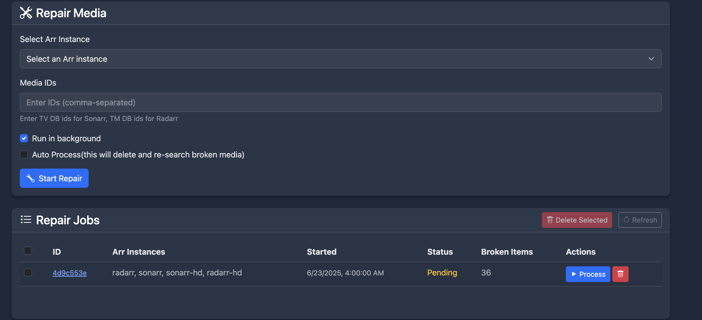

# Repair Worker

The Repair Worker is a powerful feature that helps maintain the health of your media library by scanning for and fixing issues with files.

## What It Does

The Repair Worker performs the following tasks:

- Searches for broken symlinks or file references
- Identifies missing files in your library
- Locates deleted or unreadable files
- Automatically repairs issues when possible

## Configuration

You can enable and configure the Repair Worker in the Decypharr settings. It can be set to run at regular intervals, such as every 12 hours or daily.