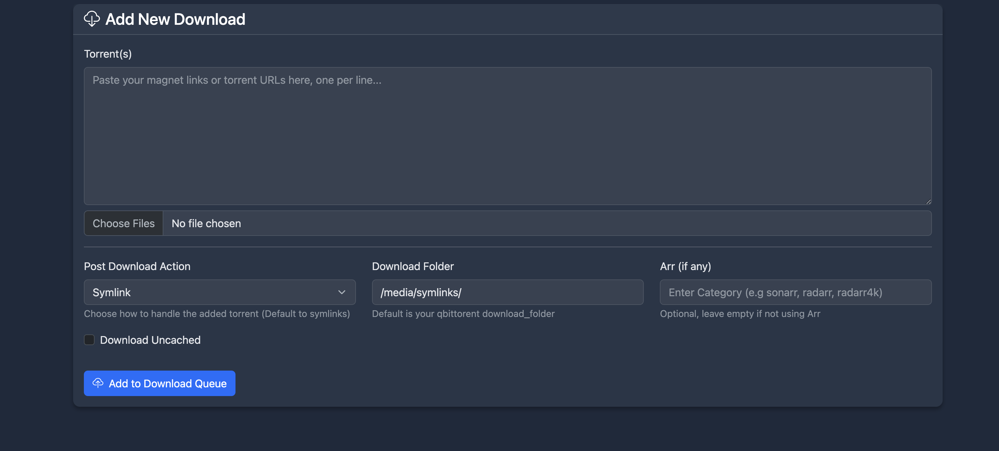

### Downloading with Decypharr

While Decypharr provides a Qbittorent API for integration with media management applications, it also allows you to manually download torrents directly through its interface. This guide will walk you through the process of downloading torrents using Decypharr.

- You can either use the Decypharr UI to add torrents manually or use its [API](../api.md) to automate the process.

## Manual Downloading

To manually download a torrent using Decypharr, follow these steps:
1. Navigate to the "Download" section in the Decypharr UI.
2. You can either upload torrent file(s) or paste magnet links directly into the input fields
3. Select the action(defaults to Symlink)

4. Add any additional options, such as:
   - *Download Folder*: Specify the folder where the downloaded files will be saved.
   - *Arr Category*: Choose the category for the download, which helps in organizing files in your media management applications.
   - **Post Download Action**: Select what to do after the download completes:
     - **Create Symlink**: Create a symlink to the downloaded files in the mount folder(default)
     - **Download**: Download the file directly.
     - **No Action**: Do nothing after the download completes.
   - **Debrid Provider**: Choose which Debrid service to use for the download(if you have multiple)
   - **Download Uncached**: If enabled, Decypharr will attempt to download uncached files from the Debrid service.

Note:
- If you use an arr category, your download will go into **{download_folder}/{arr}**